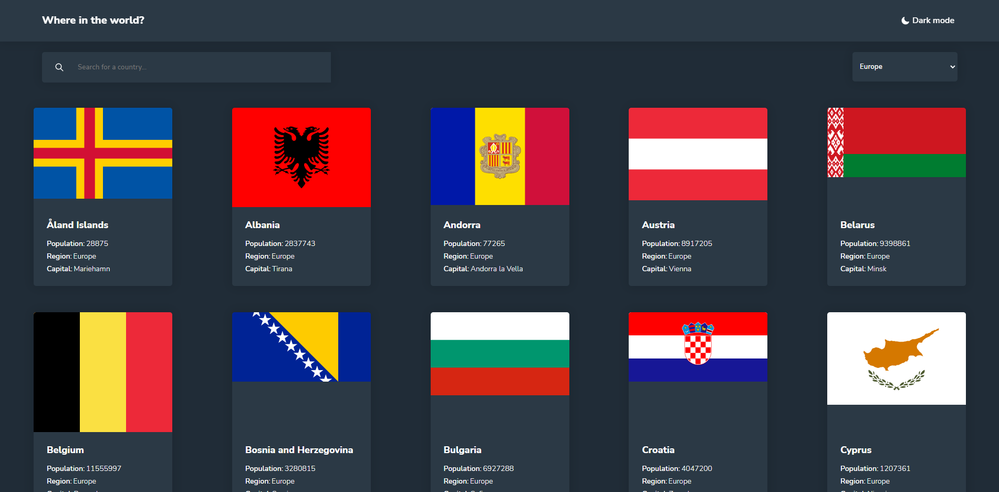

# Frontend Mentor - REST Countries API with color theme switcher solution

This is a solution to the [REST Countries API with color theme switcher challenge on Frontend Mentor](https://www.frontendmentor.io/challenges/rest-countries-api-with-color-theme-switcher-5cacc469fec04111f7b848ca). Frontend Mentor challenges help you improve your coding skills by building realistic projects. 

### The challenge

Users should be able to:

- See all countries from the API on the homepage `done`
- Search for a country using an `input` field `done`
- Filter countries by region (done) 
- Click on a country to see more detailed information on a separate page `done`
- Click through to the border countries on the detail page `done`
- Toggle the color scheme between light and dark mode *(optional)* `done`
- See design adapted to different devices `TODO`

### Screenshot

### Links

- Live Site URL: [here](https://zero0k.github.io/frontend-mentor-rest-countries-api/)

## Author

- Frontend Mentor - [@zero0k](https://www.frontendmentor.io/profile/Zero0k)

